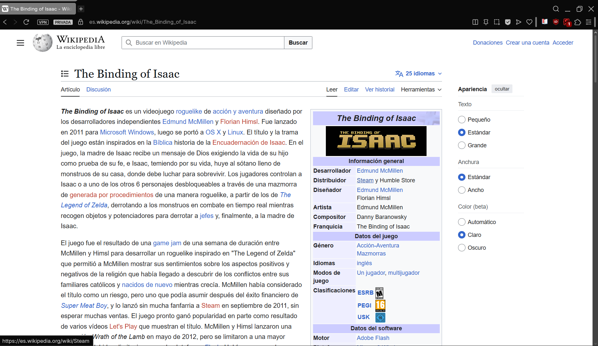

# Lab2HTML

This project is a **choose-your-own-adventure interactive story** developed using **pure HTML only**, without CSS or JavaScript.  
The story progresses through user decisions made exclusively via HTML links.

The project is designed to be served using **NGINX** on **Windows with WSL (Ubuntu or Debian)**.

---

## Publishing the Project Using NGINX (WSL + Windows)

### Step 1: Create the Project Directory

NGINX serves files from `/var/www/html/` by default. Create a directory for this project:
```bash
sudo mkdir -p /var/www/html/adventure
```

### Step 2: Clone the Repository

Clone the repository on your Windows Desktop using GitHub Desktop, Git Bash, or VS Code.

The typical path will be:
```
/mnt/c/Users/YourUsername/Desktop/adventure-lab
```

### Step 3: Copy Project Files to NGINX Directory

Copy all project files from your Windows Desktop to the NGINX web directory:
```bash
sudo cp -r /mnt/c/Users/YourUsername/Desktop/adventure-lab/* /var/www/html/adventure/
```

### Step 4: Set Proper Permissions

Ensure the web server can read the files:
```bash
sudo chmod -R 755 /var/www/html/adventure
```

### Step 5: Start NGINX

Check if NGINX is running:
```bash
sudo service nginx status
```

If it's not running, start it:
```bash
sudo service nginx start
```

### Step 6: Access the Project

Open your web browser and navigate to:
```
http://localhost/adventure/
```

---

## Troubleshooting

- If you can't access the site, verify NGINX is running with `sudo service nginx status`
- Ensure your project files are in the correct directory: `/var/www/html/adventure/`
- Check file permissions if you encounter access errors

## Part 1: Change the css to a website (racing)
### Original 


### Changed version using stylus chrome extension

The changed were made using the Wikipedia_stylus.css 


